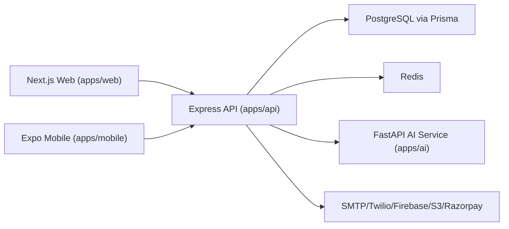
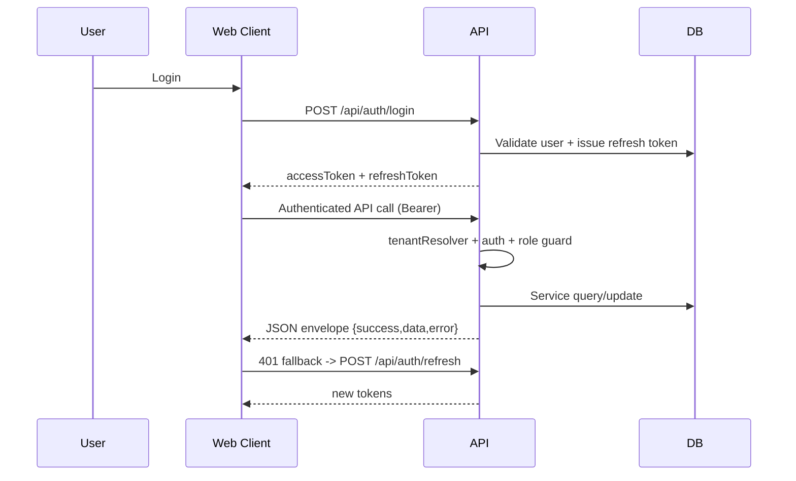

# 02 System Architecture

## High-level architecture
- Web client (apps/web) calls Express API (apps/api) over REST and socket.
- API uses PostgreSQL via Prisma and Redis for cache/rate-limit/unread counts.
- AI operations are delegated from API to a separate FastAPI service (apps/ai).
- Optional integrations: SMTP, Twilio WhatsApp, Firebase push, AWS S3, Razorpay.

Evidence:
- apps/api/src/app.ts
- apps/api/src/server.ts
- apps/api/src/lib/ai.ts
- apps/ai/app/main.py
- apps/api/src/lib/{mailer,whatsapp,firebase,s3,razorpay}.ts

## Frontend-backend flow
1. Web pages and components call API modules in apps/web/src/lib/api/*.api.ts.
2. Axios client (apiClient) injects bearer token from Zustand auth store.
3. On 401, refresh token flow calls /api/auth/refresh and retries original request.
4. API route resolves tenant context (tenantResolver), auth, role guard, then controller/service.

Evidence:
- apps/web/src/lib/api/client.ts
- apps/web/src/lib/store/auth.store.ts
- apps/api/src/middleware/tenant-resolver.ts
- apps/api/src/middleware/auth.ts
- apps/api/src/middleware/rbac.ts

## Auth/session/token flow
- Register/Login: /api/auth/register, /api/auth/login
- Refresh: /api/auth/refresh
- Logout: /api/auth/logout (requires auth)
- Current user: /api/auth/me
- Web persists tokens in localStorage and cookies used by Next middleware

Evidence:
- apps/api/src/modules/auth/auth.routes.ts
- apps/api/src/modules/auth/auth.controller.ts
- apps/web/src/lib/store/auth.store.ts
- apps/web/middleware.ts

## Role-based routing flow
- Server-side edge middleware checks cookies and redirects for protected/public paths.
- Client ProtectedRoute performs second-layer role/suspension/approval redirects.
- Role landing resolution map is centralized in routes.ts.

Evidence:
- apps/web/middleware.ts
- apps/web/src/components/auth/ProtectedRoute.tsx
- apps/web/src/lib/utils/routes.ts

## Database connection flow
- API reads DATABASE_URL through env schema validation.
- Prisma client instantiated in apps/api/src/lib/prisma.ts and used across services.
- AI service has its own async SQLAlchemy DB session for direct scoring/matching operations.

Evidence:
- apps/api/src/config/env.ts
- apps/api/src/lib/prisma.ts
- apps/ai/app/database.py
- apps/ai/app/config.py

## API request lifecycle
1. helmet, cors, compression, body parsing, input sanitization.
2. request logger + tenant resolver + rate limiter.
3. route matching in app.ts.
4. auth/role/approval middleware (route-dependent).
5. controller parses DTO and calls service.
6. service uses Prisma/lib integrations.
7. global 404 and error handler emits envelope.

Evidence:
- apps/api/src/app.ts
- apps/api/src/middleware/*
- apps/api/src/modules/*/*.controller.ts
- apps/api/src/modules/*/*.service.ts

## Deployment architecture
- Local/dev container graph: Postgres + Redis + API + Web + AI via docker-compose.
- CI validates TS, Prisma schema, backend/frontend builds, AI mypy/flake8.
- Dockerfiles present for api/web/ai images.

Evidence:
- docker-compose.yml
- .github/workflows/ci.yml
- apps/api/Dockerfile
- apps/web/Dockerfile
- apps/ai/Dockerfile

## Environment variable usage
- API requires strict env validation using zod schema.
- Web normalizes NEXT_PUBLIC_API_URL (removes trailing slash and /api).
- AI service reads .env through pydantic settings.

Evidence:
- apps/api/src/config/env.ts
- apps/web/src/lib/env.ts
- apps/ai/app/config.py
- .env.example

## External services used
- PostgreSQL (Prisma)
- Redis (cache/rate limits)
- Google/LinkedIn OAuth
- SMTP email
- Twilio WhatsApp
- Firebase Cloud Messaging
- AWS S3
- Razorpay
- AI microservice (FastAPI)

Evidence:
- apps/api/src/config/env.ts
- apps/api/src/lib/{redis,jwt,mailer,whatsapp,firebase,s3,razorpay,ai}.ts

## Mermaid Diagrams

### High-Level System

### Auth and Request Flow

